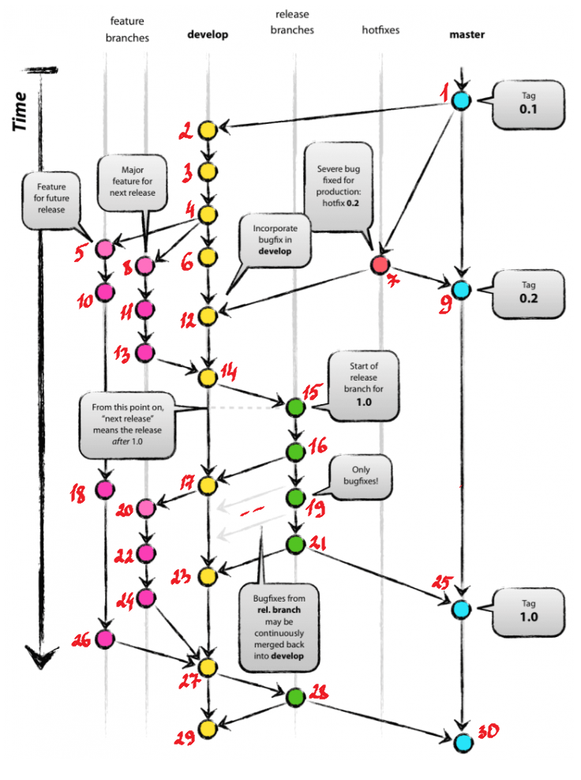

# GIT
## Project git tree
### merge --squash
https://github.com/KiokK/ct1-git/
https://github.com/KiokK/ct1-git/network
### merge --no-ff (this repos)
https://github.com/KiokK/ct1-git_m/network
## Repeat the structure

